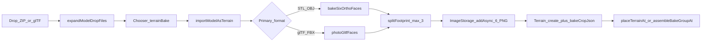
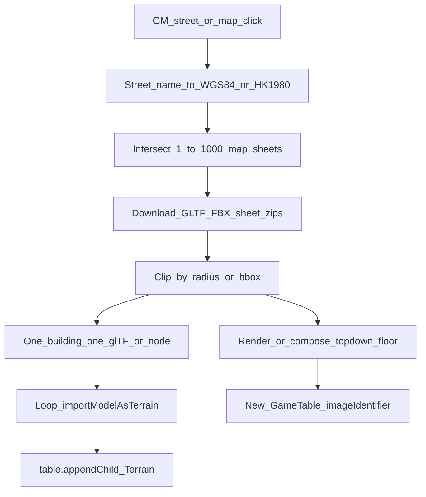

# Open3Dhk → 2.5D 街景（研究筆記）

Date gathered: 2026-08-18.  
Scope: **研究／設計 only**（本輪不實作）。目標形態：**GM 在房內選街道 → 自動讀取周邊資料 → 製成街景**。  
硬約束：**只用現成 Terrain／地圖管線**、**嚴格維持 CSS 2.5D**（不引入常駐 WebGL 城市引擎）。

相關產品語境：[微縮城市搭景](../hktrpg-tutorial.zh-TW.md#miniature-city)、[devlog 香港街景動機](../devlog.md)。

---

## Executive summary

本站已是 **CSS perspective 虛擬桌面**：地圖底圖一張圖、樓／天橋／招牌一律是 **Terrain 盒 + 六面貼圖**。Three.js 只在匯入時把模型 **烘成六面 PNG**，不常駐 3D mesh。

Open3Dhk／地政總署資料可當「原料」，但必須經 **裁切 → 單位換算 → 逐棟 bake → 寫入 ImageStorage → 掛到新 GameTable**，才能進桌。直接串 Cesium 3D Tiles／tile mesh **不符合**「只用現成地型／嚴格 2.5D」。

**建議主路徑（對齊 1B）：**

1. GM 選街道／座標／半徑（房內 UI）。  
2. 後端或瀏覽器向 **Individualised models Download API**（按 1:1000 圖幅）或預先建好的 **街段索引** 取 GLTF／FBX 周邊包。  
3. 離線／客戶端拆成「一棟一個 glTF」+ 一張俯視底圖。  
4. **重用** `importModelAsTerrain`（photo bake）逐棟落地；底圖寫入 `GameTable.imageIdentifier`。  
5. 新建地圖先 **View locally**，再 Activate／召喚。

現有匯入管線是「一次 drop＝一個場景」，**不是**城市街段批次器；要做 1B 必須加一層 **streetscape orchestrator**（仍只呼叫現成 bake，不新造渲染器）。

---

## 1. 硬約束（本設計不可破）

| 約束 | 含義 |
|---|---|
| 只用現成地型 | 輸出只能是 `GameTable` 底圖 + `Terrain` 子物件（可含斜坡／霓虹／分面貼圖）。禁止常駐 glTF／Cesium／Three scene。 |
| 嚴格 2.5D | 桌面仍是 CSS `perspective` + `preserve-3d`；Three 僅短暫用於 bake。 |
| P2P 房間 | 圖片進 `ImageStorage` 後會同步／進 ZIP；街景必須有 **棟數／解析度／總容量上限**。 |
| 非 WebGL 城市引擎 | 教學已寫明：微縮感靠配方拼，不是城市引擎（見 tutorial `#miniature-city`）。 |

違反任一項（例如桌面直接播 3D Tiles）即視為範圍外。

---

## 2. 本 repo 既有 3D 模型匯入（必須重用）

### 2.1 End-to-end

入口：

- 拖放：[`tabletop-file-drop.service.ts`](../../src/app/service/tabletop-file-drop.service.ts) → 預設 `terrainBake` → `importModelAsTerrain`
- 批次原型（dev）：[`dev-3dmodel-seed.ts`](../../src/app/service/default-room/dev-3dmodel-seed.ts) — **逐檔** `fetch` → `importModelAsTerrain` → 桌面排版（最接近未來街景 orchestrator）

核心 API：[`importModelAsTerrain`](../../src/app/class/terrain-model/model-terrain-import.ts)。

### 2.2 格式與 bake 路徑

| 格式 | Loader | Bake | 預設長邊 |
|---|---|---|---|
| STL | `parseStl` | ortho `bakeSixOrthoFaces` | 256 |
| OBJ(+MTL) | `parseObjPackage` | ortho | 256 |
| glTF / GLB | `loadGltfScene` | **photo** `photoGltfFaces` | **1024** |
| FBX | `loadFbxScene` | photo（同上） | 1024 |
| ZIP | `expandModelDropFiles`（巢狀深度 ≤ 2） | 依內含 primary | — |

Open3Dhk **Individualised models（GLTF／FBX）** 對上 **photo bake**，與現有有色模型路徑一致。

### 2.3 關鍵常數（實作時必須對齊）

| 常數 | 值 | 檔案 |
|---|---|---|
| `MODEL_MAX_FILE_BYTES` | 192 MiB／檔 | `mesh-ir.ts` |
| `MODEL_ZIP_MAX_BYTES` | 256 MiB | `model-package-files.ts` |
| `MODEL_MAX_TRIANGLES` | 80_000（僅 STL／OBJ soup） | `mesh-ir.ts` |
| `MODEL_PHOTO_BAKE_SIZE` | 1024 | `mesh-ir.ts` |
| `MODEL_MM_PER_GRID_DEFAULT` | 50（1 單位＝1 mm） | `mesh-ir.ts` |
| `MODEL_GRID_EDGE_MIN` / `MAX` | 2 / **40** grid | `mesh-ir.ts` |
| `FOOTPRINT_MAX_BOXES` | **3**（L→2、U→3） | `footprint-split.ts` |
| `IMAGE_STORED_MAX_BYTES` | **2 MiB**／圖（正規化後） | `image-normalize.ts` |

Bake 後 Terrain 存：六面 `ImageStorage` id、`bakeCropJson`（未裁像素 + CSS insets）、可選 `bakeGroupId`。執行時仍是 CSS 盒，不是 mesh。

### 2.4 對城市資料的已知缺口（街景必須補）

1. **一次 drop＝一個場景**：`loadGltfScene` 只吃袋中**第一個** glTF／FBX。整條街 ZIP 不會自動拆棟。  
2. **Footprint split ≠ 拆樓**：最多 3 個 AABB，服務單一 L／U 佔用，不是「一棟一盒」。街段必須在 bake **之前**按棟拆檔／拆 scene graph。  
3. **單位假設是 mm**：米制 Open3Dhk glTF 會被當極小 mm，再被 `fitModelGridSize` 拉到 2～40 grid。街景需要 **顯式 `mmPerGrid`／世界比例尺**（例如 1 m → N grid），不可靠自動 fit。  
4. **無 Draco／meshopt／KTX2**：壓縮城市 glTF 可能失敗或無貼圖。  
5. **同步成本**：每棟最多 6 張圖 × 2 MiB。數十棟會撐爆 P2P／ZIP。需硬上限（建議預設 ≤ 12～24 棟、低解析度牆面、重複材質 hash 共用）。  
6. **共用高度**：同一 bake 的多盒共用整模 Y 最大高度；逐棟 bake 可避開。  

**結論：** 現有管線適合「單棟／單道具微縮」；街景要加 **選取 → 下載 → 拆棟 → 比例尺 → 迴圈呼叫 `importModelAsTerrain` → 組 GameTable**，而不是改 CSS 渲染器。

---

## 3. Open3Dhk／地政資料怎麼對上 2.5D

### 3.1 產品與資料層

| 資料 | 內容 | 對本站適合度 |
|---|---|---|
| **Individualised models** | 單棟／設施幾何 + 貼圖；格式含 **GLTF、FBX** 等；CSDI／Open3Dhk 下載 | **高** — 可餵 photo bake |
| Non-textured models | 幾何無貼圖 | 中 — ortho／灰階浮雕，街景感弱 |
| Tile-based / 3D Tiles | 傾斜攝影 mesh、Cesium tileset（需 API key） | **低** — 易變成城市引擎；不符硬約束 |
| Streetscape 360 | 車載全景 | 可當參考／Cut-in，**不是** Terrain 幾何 |
| 3D Pedestrian Network | 行人網絡 | 可輔助「選街／半徑」，不直接成樓 |

入口：

- 瀏覽：`https://3d.map.gov.hk/`（Open3Dhk）  
- Individualised Download API 說明（data.gov.hk）：指定 **格式 + 地政 1:1000 圖幅編號** 自動化下載  
- 串流 API（需 key，寄 `3dmap@landsd.gov.hk`）：  
  - 3D Visualisation Map（tile）：`…/api/3d-data/3dtiles/f2/tileset.json?key=`  
  - 3D Spatial Data：`…/api/3d-data/3dsd/WGS84/{building|infrastructure}/tileset.json?key=`

**本設計預設只用 Individualised GLTF／FBX（或其圖幅 ZIP），不用 3D Tiles 當桌面內容。**

### 3.2 「選街道」在資料層的真實單位

官方下載粒度多是 **1:1000 地形圖幅**，不是「彌敦道 123 號」。因此 1B 的「選街」需要一層索引：

可行索引來源（實作階段再定）：

- 圖幅索引 PDF／CSDI 圖幅服務 + 街道中心線（政府開放數據／OSM 僅作 UX，注意授權）  
- 預先建 **街段 → 圖幅列表 + 建議 bbox** 的靜態 JSON（最穩、可離線、可控容量）  
- Open3Dhk 互動選點後匯出座標（GM 手動貼座標作 MVP）

沒有「街道字串 → glTF」的單一官方端點；**選街 UI 必須自己做 geocode／圖幅對照**。

### 3.3 三類輸出對應產品需求

| 使用者說的「烘成地圖」 | 對應本站物件 | 建議來源 |
|---|---|---|
| 地圖相片／底圖 | `GameTable.imageIdentifier`（可選 `backgroundImage*`） | 俯視合成：屋頂＋馬路 ortho（自 bake 頂視，或政府正射／底圖，注意授權） |
| 背景 | `backgroundImageIdentifier`／`backgroundImageIdentifier2` | 遠景／天際線靜態圖；勿用即時 3D |
| 地型放成建築 | `Terrain` 子物件 | Individualised 單棟 → `photoGltfFaces` → 六面盒 |

教學建議：底圖承載「馬路／天橋投影／屋頂平面」；立體 Terrain 只補「可站／擋視線」的結構——街景生成應遵守同一分工，避免把整條街做成巨型單一 Terrain。

---

## 4. 目標 UX（1B）與 UI 掛點

### 4.1 GM 流程（建議）

1. 地圖設定或場景列：**「從街道建立…」**  
2. 輸入街道名／點選小地圖／貼 WGS84 + 半徑（預設 ~80–120 m）。  
3. 預覽將下載的圖幅、預估棟數、容量警告。  
4. 確認 → 建立 **新** `GameTable`（**不**立刻 Activate）。  
5. 進度：下載 → 拆棟 → bake → 寫入底圖與 Terrain。  
6. 自動 `viewTableLocal` 預覽；滿意後 Activate／Summon。

### 4.2 自然掛點（現有程式）

| 優先 | 位置 | 理由 |
|---|---|---|
| 1 | [`game-table-setting`](../../src/app/component/game-table-setting/)「建立新地圖」旁 | 唯一正式建圖入口 |
| 2 | [`scene-nav`](../../src/app/component/scene-nav/) 加號／選單 | 生成後直接出現場景 chip |
| 3 | 桌面右鍵地圖選單 | 次要 |
| — | 勿掛 scene preset | preset 是快照，不建圖 |

地圖啟用模型：[`TableSelecter`](../../src/app/class/table-selecter.ts)（room-active vs local viewed）。街景生成應先本地 View，與現有 GM 預覽習慣一致。

### 4.3 與現有匯入的關係

| 現有 | 街景 orchestrator |
|---|---|
| 使用者拖一個模型 | 系統拉 N 個模型 |
| `mmPerGrid` 預設 50 | **強制街景比例尺**（例如 1000 mm／grid＝1 m／格，再 clamp 桌面） |
| 自動 fit 2–40 | 改為「世界座標 → 桌面 px」線性映射，桌面尺寸 `fitGameTableSizeToImage` |
| 單次 busy lock | 佇列 + UI 進度；可參考 `seedDev3dModelsOnFirstMap` 的 `yieldToUi` |
| 無 URL 圖庫 | 下載後一律 `ImageStorage.addAsync`（blob），避免熱連結失效 |

---

## 5. 建議架構（仍 2.5D）

### 5.1 模組邊界（未來實作時）

建議新碼集中（名稱示意，本輪不建檔）：

- `streetscape/` 或 `open3dhk/`  
  - `sheet-index` — 街道／座標 → 圖幅 id  
  - `fetch-pack` — Download API／快取 ZIP（CORS 可能要 **同源 proxy**）  
  - `parcelize` — 圖幅包 → 單棟 File[]（一棟一次 `importModelAsTerrain`）  
  - `world-scale` — HK1980／WGS84 → 桌面 grid／px  
  - `floor-ortho` — 合成底圖 Blob  
  - `orchestrator` — 建 `GameTable`、迴圈 bake、`appendChild`、錯誤彙總  

**禁止**新建 `CityRenderer`／常駐 Three canvas。Bake 結束即釋放 WebGL context（與現有 photo／ortho 一致）。

### 5.2 容量護欄（必須寫進產品規格）

| 護欄 | 建議預設 |
|---|---|
| 半徑 | ≤ 100 m（或 bbox 邊長 ≤ ~150 m） |
| 最大棟數 | 16（可設；超出則只留靠近街道中心線者） |
| 單棟檔案 | 沿用 192 MiB；超過跳過並警告 |
| Bake 長邊 | 街景牆面可降到 512 以控同步量 |
| 桌面格數 | ≤ 100×100；底圖經 `normalizeImageBlob` ≤ 2048 px／2 MiB |
| 同時進行 | 一房間一次生成（對齊 drop `busy`） |

### 5.3 CORS／金鑰／授權

- 瀏覽器直打 `data.map.gov.hk`／`download.map.gov.hk` 極可能遇 CORS → 需要 **HKTRPG 後端或靜態 proxy**，或 GM 預先下載後「匯入街景包」。  
- 3D Tiles API 要向地政申請 key；Individualised Download API 以圖幅參數為主——實作前需再核對現行 ToS／署名。  
- 生成地圖應在 UI 標註資料來源（LandsD／Open3Dhk）。

**務實 MVP 變體（仍屬 1B 精神）：**  
「選街」先產出／下載 **預製街景包**（manifest + 多 glTF + floor.jpg），房內 orchestrator 只負責讀包 + bake。線上即時 Download API 可作第二階段。這比硬啃 CORS／金鑰更快驗證 2.5D 手感，且仍走「GM 選街 → 自動製景」。

---

## 6. 與「只研究」對齊的結論

| 問題 | 答案 |
|---|---|
| 能用 Open3Dhk 烘成地圖相片／背景／建築地型嗎？ | **能**，但必須經 Individualised 模型 → 現有 photo bake → Terrain；底圖另合成。 |
| 能嚴格 2.5D、只用現成地型嗎？ | **能**，只要不把 3D Tiles 掛上桌面。 |
| GM 選街自動讀周邊？ | **資料層沒有現成「街道 API」**；要圖幅索引 + bbox 裁切 +（多半）proxy。UI／流程可掛在建圖與 scene-nav。 |
| 現有 3D 匯入夠不夠？ | **單棟夠；街段不夠**。缺：拆棟、世界比例尺、批次編排、容量護欄、底圖合成。Dev seed 已證明「多檔迴圈 import」可行。 |
| 本輪交付 | 本文件。實作應另開 issue／PR，先做街景包 MVP 再接即時下載。 |

---

## 7. 建議後續實作順序（非本 PR）

1. **Spike：** 取一個 1:1000 圖幅 GLTF 包，手動拆 3～5 棟，用現有拖放 bake，量單位與貼圖是否可用（Draco？米制？）。  
2. **比例尺：** 擴充 `ImportModelAsTerrainOptions` 支援「世界公尺 → grid」且可關閉 2–40 auto-fit（或街景專用入口）。  
3. **Orchestrator MVP：** 讀本地／proxy `manifest.json`（仿 `dev-3dmodel-seed`）→ 新 GameTable + 底圖 + 逐棟 bake。  
4. **選街 UI：** 街道名／點選 → 查靜態索引 → 選 manifest。  
5. **Download API／proxy：** 圖幅自動抓取、快取、署名與 ToS。  
6. **護欄與 UX：** 棟數上限、進度、失敗跳過、先 View 再 Activate。

---

## 8. 主要程式索引

| 主題 | 路徑 |
|---|---|
| 匯入總入口 | `src/app/class/terrain-model/model-terrain-import.ts` |
| Photo bake | `src/app/class/terrain-model/photo-gltf-faces.ts` |
| Ortho bake | `src/app/class/terrain-model/ortho-bake.ts` |
| 限制常數 | `src/app/class/terrain-model/mesh-ir.ts` |
| L／U 拆盒 | `src/app/class/terrain-model/footprint-split.ts` |
| 拖放 | `src/app/service/tabletop-file-drop.service.ts` |
| 多模批次原型 | `src/app/service/default-room/dev-3dmodel-seed.ts` |
| Terrain 模型 | `src/app/class/terrain.ts` |
| 地圖／啟用 | `src/app/class/game-table.ts`, `table-selecter.ts` |
| 建圖 UI | `src/app/component/game-table-setting/` |
| 微縮配方 | `docs/hktrpg-tutorial.zh-TW.md` `#miniature-city` |

---

## 9. 外部參考

- Open3Dhk：https://3d.map.gov.hk/  
- LandsD 3D Mapping：https://www.landsd.gov.hk/en/survey-mapping/mapping/3d-mapping.html  
- Individualised models（data.gov.hk）＋ Download API 說明：按格式與 1:1000 圖幅自動化下載  
- 3D Visualisation Map API / 3D Spatial Data API（CSDI；Cesium 3D Tiles；需 key）  
- 聯絡：`3dmap@landsd.gov.hk`（API key）

---

## 10. 決策記錄（本輪）

| 項 | 選擇 |
|---|---|
| 交付形態 | **1B** 房內選街自動製景（設計目標） |
| 本輪產出 | **2A** 研究文件 only |
| 渲染 | 嚴格 2.5D + 現成 Terrain bake |
| 主資料 | Individualised GLTF／FBX；**不用** 3D Tiles 當桌面 |
| 實作切入 | 先街景包 + orchestrator（仿 dev seed），再接 Download API／proxy |
