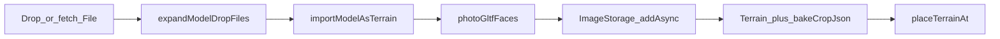
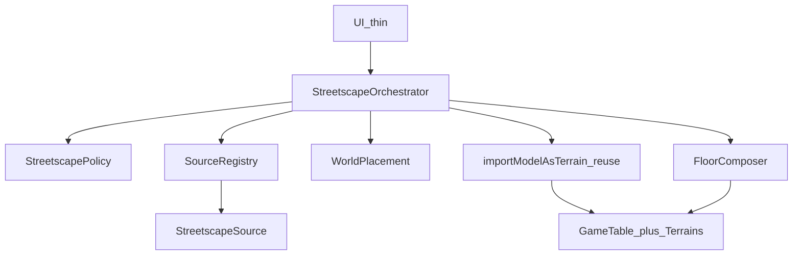
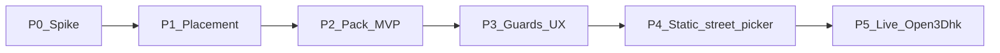

# Open3Dhk → 2.5D 街景（研究筆記）

Date gathered: 2026-08-18 · Revised: 2026-08-18（review 修正）.  
Scope: **研究／設計 only**（本輪不實作）。  
產品目標（遠景）：GM 選街道 → 載入周邊 → 製成 2.5D 街景。  
硬約束：只用現成 `GameTable` + `Terrain` bake；嚴格 CSS 2.5D；不引入常駐城市引擎。

相關：[微縮城市搭景](../hktrpg-tutorial.zh-TW.md#miniature-city)、[devlog](../devlog.md)。

---

## Executive summary

原料走 **Open3Dhk Individualised GLTF／FBX** → 現有 `photoGltfFaces`／`importModelAsTerrain` → Terrain 盒；底圖寫入 `GameTable.imageIdentifier`。**禁用** Cesium 3D Tiles 當桌面內容。

**MVP 不是真・即時 1B。** 先驗證「街景包 → bake → 可玩地圖」；選街／Download API = 註冊新 Source，契約不變。護欄與品質 **不 hardcode 進編排器**，走 Policy／Pack。

| 層 | MVP | 遠景 1B |
|---|---|---|
| 資料 | 預製 **Streetscape Pack**（versioned manifest） | 註冊 `open3dhk` Source |
| 選取 | 靜態街段清單（或拖入 pack） | 街道名／點選／半徑 |
| 核心 | 同一 Orchestrator + **StreetscapePolicy** | 不變 |

**硬閘門：** Phase 0 Spike 未過，不開 orchestrator／UI。

---

## 1. 硬約束

| 約束 | 含義 |
|---|---|
| 只用現成地型 | 只產出 `GameTable` + `Terrain`（可斜坡／霓虹／分面）。禁止常駐 glTF／Cesium／Three scene。 |
| 嚴格 2.5D | CSS `perspective`；Three 僅短暫 bake。 |
| P2P 容量 | 圖片進 `ImageStorage`；上限由 **StreetscapePolicy**（可被 Pack／執行時覆寫）約束，不散落魔術數字。 |
| 最小表面積 | 新碼只加「資料適配 + 編排」；不複製 bake／不新渲染器。 |

---

## 2. 既有 3D 匯入（必須重用，不叉開）

### 2.1 管線



- 拖放：`tabletop-file-drop.service.ts` → `terrainBake`
- 多檔原型：`dev-3dmodel-seed.ts`（迴圈 import；街景編排應長得像它，不是像城市引擎）
- 核心：`importModelAsTerrain`（已有 `mmPerGrid`；**仍會**走 `fitModelGridSize` 2–40）

### 2.2 街景必須補的缺口

| 缺口 | 影響 | 最小修法 |
|---|---|---|
| 一次一場景 | 圖幅 ZIP 不會拆棟 | Pack／Provider 保證 **一棟一 primary** |
| auto-fit 2–40 | 相對距離錯亂 | 街景路徑 **關閉 fit**，世界座標線性放置 |
| 單位當 mm | 米制模型縮放錯 | Pack 宣告 `metersPerUnit`；編排換算 `mmPerGrid` |
| 無 Draco／KTX2 | 部分官方包載不入 | Spike 判定；必要時 **離線轉檔進 Pack**（不塞進瀏覽器 loader） |
| 同步體積 | 多棟×六面易爆 P2P | **Policy** 限特徵數／bake 邊／可略面；數字不散落程式 |
| Footprint≤3 盒 | ≠ 拆樓 | 不拿 footprint-split 當拆棟；拆棟在 Pack 建置時完成 |

---

## 3. 資料策略（鎖定）

### 3.1 用什麼／不用什麼

| 資料 | 決策 |
|---|---|
| Individualised GLTF／FBX | **採用**（經 Pack 或後續 Provider） |
| 3D Tiles／tile mesh | **不用**（桌面內容） |
| Streetscape 360 | 非幾何；可選 Cut-in，非 MVP |
| Infrastructure（天橋等） | **Pack schema 預留 `kind`**；MVP 可 0 筆，不另開管線 |

### 3.2 底圖（鎖定 MVP）

不做真·政府正射對位（授權／對齊成本高）。

**MVP floor：** 由編排器合成簡易俯視——路面色塊 + 各棟 footprint／頂視縮圖貼上。來源是 bake 過程的頂視（或 pack 內可選 `floor.jpg`）。遠景可換成正射 Provider，**Orchestrator 只吃 `Blob`／image id**。

### 3.3 「選街」真實單位

官方下載多是 **1:1000 圖幅**，沒有「街道 → glTF」端點。選街 = UX；真正契約是 **Pack 或 bbox→圖幅→拆棟**。Live Download／CORS／ToS **未端到端驗證**——屬 Phase 5，不擋 MVP。

---

## 4. 架構：最小核心 + 可替換邊界

原則：

1. **一個編排器、一個放置模型、一個 Pack 契約；Source 可註冊。**  
2. **零魔術數字進 Orchestrator**——護欄／bake／比例尺只來自 **Policy（預設表）∪ Pack 覆寫 ∪ 執行時選項**。  
3. 不預建 `sheet-index`／`fetch-pack`／`parcelize` 空模組。



### 4.1 模組（未來實作時只這四塊 + 一張 Policy）

| 模組 | 職責 | 不做 |
|---|---|---|
| **`StreetscapeSource`** | `resolve(query) → StreetscapePack`（async） | bake、DOM、SyncObject |
| **`WorldPlacement`** | 依 Policy／Pack 的公尺→桌面；可關 fit | 載檔、寫死 scale |
| **`FloorComposer`** | Pack＋策略 → floor Blob | 3D、寫死路面色以外的主題（色票進 Policy） |
| **`StreetscapeOrchestrator`** | 合併 Policy → 取 Source → bake → 掛表 → local View | 自家 WebGL、內嵌上限常數 |
| **`StreetscapePolicy`** | 唯一預設護欄／bake／placement 表 | 業務流程 |

UI：掛點用既有 i18n key；先 View 再 Activate。Source 用 **id 註冊**（`pack-file`、`pack-catalog`、`open3dhk`…），UI／Orchestrator 不 `if (source === 'open3dhk')` 分叉業務。

### 4.2 減少 hardcode：數字與分支都外置

| 反模式 | 做法 |
|---|---|
| Orchestrator 內寫 `8`、`512`、`100` | 讀 `StreetscapePolicy`；Pack `policy` 可覆寫；UI 可再覆寫 |
| `kind: 'building' \| …` 寫死聯集當唯一真相 | `kind: string`；已知 kind 只是 **預設目錄／篩選建議**，未知 kind 當 `prop` 或略過（Policy `unknownKind`） |
| Source 用 switch 寫死 | `SourceRegistry.register(id, factory)` |
| 比例尺／原點寫在程式 | Pack 必填 `metersPerUnit`／`origin`／`extentMeters` |
| 路面色、署名字串寫死 | Policy `floor`／Pack `attribution`；UI 只顯示資料 |
| 重造一套 bake 常數 | 能代理則代理現有 `MODEL_*`；街景專用項只進 Policy |

**合併順序（後者覆蓋前者）：**  
`builtinPolicyDefaults` → `pack.policy?` → `runOptions.policy?` → 得出 `EffectivePolicy`。  
Orchestrator **只讀 EffectivePolicy**，禁止再出現字面上限。

```ts
/** 執行時護欄／品質——不是業務邏輯 */
type StreetscapePolicyV1 = {
  maxFeatures: number;
  bakeMaxEdgePx: number;
  skipFaces?: TerrainFaceName[];   // e.g. ['underside']
  fitGrid: boolean;                // streetscape 預設 false
  /** 1 桌面格對應多少公尺；由 Pack extent 與桌面上限推也可 */
  metersPerGrid?: number;
  maxTableCells: number;           // 對齊 GameTable 上限時從現有常數讀，勿抄第二份
  maxFloorEdgePx?: number;         // 無則跟現有 image normalize 上限
  maxEstimatedSyncMiB?: number;    // 預檢用；超則拒絕或裁切
  featureSort: 'distanceToOrigin' | 'manifestOrder';
  unknownKind: 'import' | 'skip';
  floor?: { pavementCssColor?: string };
};

type StreetscapePackV1 = {
  version: 1;
  id: string;
  title: string;
  attribution: string;
  metersPerUnit: number;
  axis?: 'y-up' | 'z-up';         // 預設 y-up；勿在程式猜
  origin: { x: number; z: number };
  extentMeters: { width: number; depth: number };
  floor?: { path: string };
  features: StreetscapeFeatureV1[];
  /** 可選；覆寫 builtin defaults */
  policy?: Partial<StreetscapePolicyV1>;
};

type StreetscapeFeatureV1 = {
  id: string;
  kind: string;                    // building | infrastructure | prop | …
  path: string;
  positionMeters: { x: number; z: number };
  yawDeg?: number;
  sizeMeters?: { w: number; d: number; h: number };
};
```

**Builtin 預設（僅出現在 Policy 預設表／文件範例，不當分散常數）：**

| 鍵 | 建議預設 | 註 |
|---|---|---|
| `maxFeatures` | 8 | Pack／UI 可改 |
| `bakeMaxEdgePx` | 512 | |
| `fitGrid` | `false` | |
| `featureSort` | `distanceToOrigin` | 裁切時用 |
| `unknownKind` | `import` | |
| `maxTableCells` | 讀現有 GameTable 上限 | **單一真相，不複製數字** |
| 圖檔上限 | 讀 `IMAGE_*`／normalize | 同上 |

### 4.3 Pack／Source（擴充點＝資料，不是 if）

- **MVP Source（`pack-file`）：** zip／資料夾 + `manifest.json` → `StreetscapePackV1`。  
- **目錄 Source（`pack-catalog`）：** 遠端／本地 index → 同一個 Pack。  
- **遠景（`open3dhk`）：** 圖幅下載＋建置期拆棟 → **仍輸出 Pack**；瀏覽器不解析圖幅百科。  
- 擴充 = 註冊新 Source 或加 Pack 欄位（`version` bump）；**不改 Orchestrator 主流程**。

### 4.4 對現有 API 的最小侵襲

| 變更 | 理由 |
|---|---|
| `ImportModelAsTerrainOptions` 加 `fitGrid?: boolean`（預設 `true`） | 由 EffectivePolicy 傳入；不寫死街景分支 |
| bake 邊長經既有 `bakeSize` opts 傳入 | 對齊 Policy `bakeMaxEdgePx` |
| **擇一**放置路徑，禁止雙軌 | 要嘛關 fit 走 import，要嘛自管 place——Policy 決定行為，程式只一條 |
| Draco 等不預裝 | Spike 後若需要，用 **可選 loader 註冊**，非預設 hard dep |

放置：`positionMeters` × EffectivePolicy 比例尺 → table px（地理相對，非一字排）。

---

## 5. UX（遠景與 MVP）

**MVP：**「匯入街景包」或「選預製街段」→ 新 `GameTable`（不 Activate）→ 進度 → `viewTableLocal`。

**遠景 1B：** 同一入口升級為選街道／半徑；Source 換成即時／半即時，**UX 殼可共用**。

掛點優先：`game-table-setting`「建立新地圖」旁 → `scene-nav` 次之。勿掛 scene preset。

---

## 6. Phase（硬順序）



| Phase | 產出 | 通過條件 | 不做 |
|---|---|---|---|
| **0 Spike** | 真實圖幅樣品 + 筆記 | 3～5 棟可進現有拖放 bake；單位／壓縮／單棟 MB 已知；拆棟步驟可手做記錄 | 任何正式模組 |
| **1 Placement** | `fitGrid: false`（或等價）+ 公尺→px | 兩棟相對距離大致正確 | UI／下載 |
| **2 Pack MVP** | Pack v1 + Orchestrator + FloorComposer | 拖入／載入一包 → 可玩 2.5D 地圖 | 選街、官方 API |
| **3 Guards／UX** | EffectivePolicy 預檢、進度、失敗跳過、署名 | 壞檔不整表炸掉；護欄可調 | Live |
| **4 靜態選街** | `pack-catalog` Source + 預製街段 | GM「選街」體感；資料仍 Pack | Download API |
| **5 Live 1B** | 註冊 `open3dhk` Source + proxy／ToS | CORS、圖幅、拆棟驗證後 | 改核心編排／抄常數 |

P0 失敗（例如全數 Draco、單位混亂）：改為 **離線建置 Pack 的工具鏈**，瀏覽器只吃 P2——架構仍成立。

---

## 7. 結論

| 問題 | 答案 |
|---|---|
| 能烘成底圖／背景／建築地型？ | 能：floor Blob + 可選 background 圖 + Terrain bake。 |
| 嚴格 2.5D？ | 能：不掛 3D Tiles。 |
| 真・選街即時？ | 遠景；**MVP＝Pack + 可選靜態街段**。 |
| 現有匯入夠？ | 單棟夠；街景要 Pack + Policy 驅動放置／護欄 + 薄 Orchestrator。 |
| 架構怎麼擴？ | **Source 註冊 + Pack／Policy 外置**；Orchestrator 無魔術數字。 |

---

## 8. 程式索引

| 主題 | 路徑 |
|---|---|
| 匯入 | `src/app/class/terrain-model/model-terrain-import.ts` |
| Photo bake | `src/app/class/terrain-model/photo-gltf-faces.ts` |
| 常數／fit | `src/app/class/terrain-model/mesh-ir.ts` |
| 多檔原型 | `src/app/service/default-room/dev-3dmodel-seed.ts` |
| 拖放 | `src/app/service/tabletop-file-drop.service.ts` |
| Terrain／地圖 | `src/app/class/terrain.ts`, `game-table.ts`, `table-selecter.ts` |
| 建圖 UI | `src/app/component/game-table-setting/` |

## 9. 外部參考

- https://3d.map.gov.hk/  
- https://www.landsd.gov.hk/en/survey-mapping/mapping/3d-mapping.html  
- data.gov.hk Individualised models／Download API（圖幅＋格式；**待 Spike／P5 實測**）  
- CSDI 3D Tiles API（需 key）— **非桌面路徑**  
- `3dmap@landsd.gov.hk`

## 10. 決策記錄

| 項 | 選擇 |
|---|---|
| 遠景 | 1B 選街自動製景 |
| 本輪 | 研究文件 only |
| 渲染 | 2.5D + 現成 Terrain |
| 主資料 | Individualised → Pack；不用 3D Tiles |
| MVP | Pack v1 + Orchestrator；非 Live API |
| 底圖 | 合成俯視／pack 內 floor；非正射 MVP |
| 擴充 | Source 註冊 + versioned Pack；四模組 + Policy |
| Hardcode | 護欄／bake／比例尺只在 Policy∪Pack∪runOptions；桌面／圖檔上限讀現有常數 |
| 閘門 | P0 Spike 不過不往下做 |
