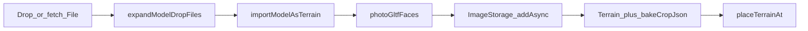
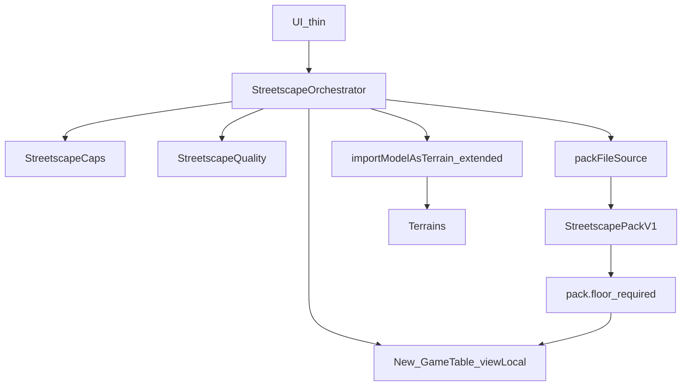
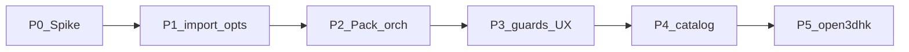

# Open3Dhk → 2.5D 街景（研究筆記）

Date gathered: 2026-08-18 · Revised: 2026-08-18（架構 review 收斂 + 實作計畫）.  
Scope: **研究／設計 only**（本輪不實作 runtime）.  
產品遠景：GM 選街道 → 載入周邊 → 2.5D 街景.  
硬約束：只用 `GameTable` + `Terrain` bake；嚴格 CSS 2.5D；不引入常駐城市引擎.

相關：[微縮城市搭景](../hktrpg-tutorial.zh-TW.md#miniature-city)、[devlog](../devlog.md).

---

## Executive summary

原料：**Open3Dhk Individualised GLTF／FBX** → 現有 `photoGltfFaces`／`importModelAsTerrain` → Terrain；底圖 = Pack 內 `floor`. **禁用** 3D Tiles 當桌面內容.

**MVP ≠ 真・即時 1B.** 先 Pack → bake → 可玩地圖；Live 選街 = 晚綁 Source.

架構 review 後鎖定：

1. **放置併入 import opts**（路徑 A）——不另建 `WorldPlacement`  
2. **Caps ≠ Quality**——Pack 不能放寬 P2P 硬上限  
3. **MVP 強制 `pack.floor`**——暫緩 FloorComposer／Registry／`skipFaces`

**硬閘門：** Phase 0 Spike 未過，不開 Orchestrator／UI.

| 層 | MVP | 遠景 1B |
|---|---|---|
| 資料 | Streetscape Pack v1 | `open3dhk` Source（仍輸出 Pack） |
| 選取 | 匯入 zip／檔 | 街道／半徑 UX |
| 核心 | Orchestrator + Caps／Quality + 擴充後的 import | 不變 |

---

## 1. 硬約束

| 約束 | 含義 |
|---|---|
| 只用現成地型 | 只產出 `GameTable` + `Terrain`. 禁止常駐 glTF／Cesium／Three scene. |
| 嚴格 2.5D | CSS `perspective`；Three 僅短暫 bake. |
| P2P 容量 | **Caps** 硬上限；Quality 可調但 clamp. |
| 最小表面積 | 只加適配 + 編排；不複製 bake／不新渲染器. |

---

## 2. 既有 3D 匯入（必須重用）

### 2.1 管線



- 拖放：`tabletop-file-drop.service.ts`  
- 多檔原型：`dev-3dmodel-seed.ts`（編排應像它）  
- 核心：`importModelAsTerrain`（有 `mmPerGrid`／`bakeSize`；**仍會** `fitModelGridSize` 2–40；綁 `viewTable`）

### 2.2 缺口 → 計畫對應

| 缺口 | 計畫修法 |
|---|---|
| 一次一場景 | Pack 保證一棟一 primary |
| auto-fit 2–40 | import opts `fitGrid: false`（P1） |
| 單位當 mm | Pack `metersPerUnit` + 單一比例尺公式 |
| 無 Draco／KTX2 | Spike；必要時離線轉進 Pack |
| 同步體積 | Caps 裁切特徵／限制 bake 邊 |
| Footprint≠拆樓 | 建置期拆棟；瀏覽器不拆 |
| bake 寫錯表 | `parentTable` + 先 `viewLocal` 再 import |

---

## 3. 資料策略

| 資料 | 決策 |
|---|---|
| Individualised GLTF／FBX | 採用（經 Pack） |
| 3D Tiles | 不用（桌面） |
| Streetscape 360 | 非 MVP |
| Infrastructure | `kind` 預留；MVP 可 0 筆 |
| 底圖 | **MVP：`floor.path` 必填**；合成 FloorComposer = P3+ |
| 選街 | UX；契約仍是 Pack. Live API = P5（未實測 CORS／ToS） |

---

## 4. 架構（已收斂）

### 4.1 原則

1. 新碼 = 適配 + 編排.  
2. 穩定契約 = **Pack v1**；換源 = 換 Source.  
3. **Caps（不可被 Pack 放寬）** vs **Quality（可調，clamp）**.  
4. 第二個 Source 前不加 Registry；無 floor 檔前不做 FloorComposer.  
5. **禁止** 獨立 Placement 與 import 雙軌.

### 4.2 MVP 目標形態

```text
UI → Orchestrator
        ├─ resolveCaps()
        ├─ packFileSource.load()
        ├─ mergeQuality(pack, runOpts) → clamp(caps)
        ├─ create GameTable + viewTableLocal
        ├─ for feature: importModelAsTerrain({
        │     fitGrid: false, bakeSize, mmPerGrid,
        │     position, yaw, parentTable, name
        │   })
        └─ imageIdentifier ← pack.floor
```



### 4.3 模組：MVP vs 延後

| 單元 | MVP | 延後 |
|---|---|---|
| Orchestrator | 必做 | — |
| `pack-file` Source | 必做（直接注入） | — |
| Caps + Quality | 必做 | — |
| Pack v1（`floor` 必填） | 必做 | — |
| import opts：`fitGrid`／`parentTable`／世界放置 | 必做 | — |
| SourceRegistry | — | P4 |
| FloorComposer | — | P3+ |
| `open3dhk` Source | — | P5（只產／載 Pack） |
| `skipFaces` | — | bake 支援後 |

### 4.4 Caps／Quality／Pack

```ts
type StreetscapeCapsV1 = {
  maxFeatures: number;
  maxEstimatedSyncMiB: number;
  maxTableCells: number;   // from GameTable — do not duplicate
  maxImageBytes: number;   // from IMAGE_* / normalize
};

type StreetscapeQualityV1 = {
  bakeMaxEdgePx: number;
  fitGrid: boolean;        // streetscape default false
  featureSort: 'distanceToOrigin' | 'manifestOrder';
  unknownKind: 'import' | 'skip';
};

type StreetscapePackV1 = {
  version: 1;
  id: string;
  title: string;
  attribution: string;
  metersPerUnit: number;
  axis?: 'y-up' | 'z-up';
  origin: { x: number; z: number };
  extentMeters: { width: number; depth: number };
  floor: { path: string };          // required in MVP
  features: StreetscapeFeatureV1[];
  quality?: Partial<StreetscapeQualityV1>;
};

type StreetscapeFeatureV1 = {
  id: string;
  kind: string;
  path: string;
  positionMeters: { x: number; z: number };
  yawDeg?: number;
  sizeMeters?: { w: number; d: number; h: number };
};
```

合併：`qualityMerged = clamp(merge(builtinQuality, pack.quality, runOptions), caps)`.

**比例尺（單一公式）：**

```text
tableCellsX = min(caps.maxTableCells, derivedFromExtent)
metersPerGrid = extentMeters.width / tableCellsX
mmPerGrid = metersPerGrid * 1000 / metersPerUnit
```

Builtin 範例（只活在 Caps／Quality 表）：`maxFeatures=8`、`bakeMaxEdgePx=512`、`fitGrid=false`.

### 4.5 Source 契約

```ts
type StreetscapeSource = {
  readonly id: string;
  resolve(query: StreetscapeQuery, signal?: AbortSignal): Promise<StreetscapePackLoad>;
};

type StreetscapePackLoad = {
  pack: StreetscapePackV1;
  openFeature(id: string): Promise<File[]>;
  openFloor(): Promise<Blob>;
};
```

Client **只載 Pack**；拆棟／轉檔在建置期或服務端. 錯誤對齊 `MODEL_*`；支援取消.

### 4.6 import 侵襲（鎖定路徑 A）

| opts | 說明 |
|---|---|
| `fitGrid?: boolean`（預設 `true`） | 街景傳 `false` |
| `parentTable?: GameTable` | 先建表再 bake |
| 世界放置 | Orchestrator 算 table px／yaw，經既有 place——一條路徑 |
| `bakeSize` | 已有 ← Quality |

---

## 5. UX

- **MVP：** 匯入街景包 → 新表（不 Activate）→ 進度／預估 MB → `viewTableLocal`  
- **P4：** 靜態街段目錄（仍 Pack）  
- **P5：** 選街 UX + `open3dhk` Source  

掛點：`game-table-setting` 為主；`scene-nav` 次之. 勿掛 scene preset.

---

## 6. 實作計畫（Plan）



| Phase | 產出 | 通過條件 | 明確不做 |
|---|---|---|---|
| **0 Spike** | 真實圖幅樣品 + 筆記 | 3～5 棟可拖放 bake；單位／壓縮／MB／拆棟步驟已知 | 正式模組、UI |
| **1 import opts** | `fitGrid` + `parentTable` + 世界放置 | 兩棟相對距離正確；寫入指定表 | Source、選街 |
| **2 Pack MVP** | Pack v1（floor 必填）+ `pack-file` + Orchestrator + Caps／Quality | 匯入一包 → 可玩 2.5D 地圖 | Registry、FloorComposer、Live API |
| **3 Guards／UX** | 預估 MB、進度、失敗跳過、署名；可選 FloorComposer | 壞檔不整表炸掉；Pack 無法放寬 Caps | Live |
| **4 Catalog** | SourceRegistry + `pack-catalog` | GM 選預製街段 | Download API |
| **5 Live 1B** | `open3dhk` + proxy／ToS；服務端／建置拆棟 | CORS／圖幅驗證；瀏覽器仍只吃 Pack | 改核心編排、桌面 3D Tiles |

P0 失敗 → 離線建 Pack 工具鏈，瀏覽器仍走 P2.

### 6.1 建議實作順序（檔案級，待開 PR）

1. **P1** — `model-terrain-import.ts`／`mesh-ir.ts`：`fitGrid`、`parentTable`；規格測試兩棟距離.  
2. **P2** — `streetscape/pack-schema.ts`、`caps.ts`、`pack-file-source.ts`、`orchestrator.ts`；`game-table-setting` 極薄入口.  
3. **P3** — 預檢 UI、署名、i18n；需要時才加 `floor-composer.ts`.  
4. **P4+** — registry + catalog；再 `open3dhk`（repo 外建置管線可並行）.

---

## 7. 結論

| 問題 | 答案 |
|---|---|
| 底圖／建築？ | `pack.floor` + Terrain bake |
| 嚴格 2.5D？ | 是；不掛 3D Tiles |
| 真・選街？ | P5；MVP＝Pack |
| 現有匯入？ | 擴 opts（路徑 A），無雙軌 Placement |
| 怎麼擴？ | Pack 契約 + 晚綁 Source；Caps 護欄 |

---

## 8. 程式索引

| 主題 | 路徑 |
|---|---|
| 匯入 | `src/app/class/terrain-model/model-terrain-import.ts` |
| Photo bake | `src/app/class/terrain-model/photo-gltf-faces.ts` |
| 常數／fit | `src/app/class/terrain-model/mesh-ir.ts` |
| 多檔原型 | `src/app/service/default-room/dev-3dmodel-seed.ts` |
| 拖放 | `src/app/service/tabletop-file-drop.service.ts` |
| Terrain／地圖 | `src/app/class/terrain.ts`, `game-table.ts`, `table-selecter.ts` |
| 建圖 UI | `src/app/component/game-table-setting/` |

## 9. 外部參考

- https://3d.map.gov.hk/  
- https://www.landsd.gov.hk/en/survey-mapping/mapping/3d-mapping.html  
- data.gov.hk Individualised／Download API（**待 P0／P5 實測**）  
- CSDI 3D Tiles — **非桌面路徑**  
- `3dmap@landsd.gov.hk`

## 10. 決策記錄

| 項 | 選擇 |
|---|---|
| 遠景 | 1B 選街自動製景 |
| 本輪 | 研究 + 實作計畫 only |
| 渲染 | 2.5D + 現成 Terrain |
| 主資料 | Individualised → Pack；不用 3D Tiles |
| MVP | Pack v1 + Orchestrator；`floor` 必填 |
| 放置 | import opts 路徑 A；無 WorldPlacement |
| 護欄 | Caps（不可放寬）∪ Quality（clamp） |
| 延後 | Registry、FloorComposer、skipFaces、Live API |
| 閘門 | P0 Spike |
